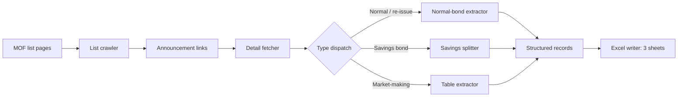

# china-bond-announcement-scraper

A Python scraper that collects Chinese Government Bond (CGB) business announcements published by the Ministry of Finance (MOF) of the PRC and converts them into structured Excel workbooks.

## Features

- **Automated list traversal** — walks every announcement list page with no manual paging and stops after consecutive empty pages.
- **Multi-type coverage** — coupon-bearing (附息), discount (贴现), special (特别), and savings (储蓄) government bonds, plus market-making support operations (做市支持操作).
- **Smart tenor inference** — derives the maturity of re-issue (续发行) announcements from the principal repayment date.
- **Savings-bond splitting** — expands combined multi-tranche savings announcements into individual rows.
- **Market-making table extraction** — parses operation tables with merged-cell handling.
- **Formatted Excel output** — styled headers, frozen top row, and auto-fitted column widths across three sheets.
- **Polite crawling** — randomized 0.3–0.5s delay between requests.

## Architecture



## How it works

1. **List crawl** — fetches `BASE_URL` and `index_{n}.htm` pages, parsing every link whose title matches the `YYYY年第N号 国债业务公告` pattern.
2. **Deduplicate and sort** — keeps unique `(year, num)` pairs, sorted newest-first.
3. **Detail fetch** — downloads each announcement page (polite delay between requests).
4. **Type dispatch** — classifies each page as market-making, savings, or normal/re-issue, then routes to the matching extractor.
5. **Structured extraction** — regex and numeric parsing pulls issuance amount, tenor, price, coupon/yield, dates, and operation details into typed records.
6. **Excel write** — emits a workbook with three sheets (see schema below).

## Quick start

```bash
pip install requests beautifulsoup4 openpyxl
python3 crawl_treasury_bonds.py
```

The script writes `国债业务公告数据.xlsx` in the current directory with three sheets:

| Sheet | Contents | Approx. volume |
|-------|----------|----------------|
| 国债发行数据 | Standard + re-issue issuance announcements | ~130 records |
| 储蓄国债数据 | Savings bonds (split by tranche) | ~4 records |
| 做市操作数据 | Market-making support operations | ~16 records |

*Sample window: 2025/01/08 – 2026/06/24.*

### Optional configuration

Copy `.env.example` to `.env` to override defaults:

```bash
cp .env.example .env
```

| Variable | Default | Description |
|----------|---------|-------------|
| `CGB_BASE_URL` | `https://zwgls.mof.gov.cn/ywgg/` | Announcement list root |
| `CGB_USER_AGENT` | Browser UA string | Custom request user-agent |
| `CGB_DELAY_MIN` / `CGB_DELAY_MAX` | `0.3` / `0.5` | Random delay range (seconds) |
| `CGB_OUTPUT_FILE` | `国债业务公告数据.xlsx` | Output workbook path |

## Output schema

**国债发行数据 (issuance)**

| Field | Description |
|-------|-------------|
| 公告标题 | Full announcement title |
| 年份 / 公告编号 | Year / announcement number |
| 国债类型 | Coupon / discount / re-issue / special |
| 计划发行(亿元) / 实际发行(亿元) | Planned / actual issuance (CNY 100M) |
| 期限 | Tenor (e.g. `30年`, `91天`) |
| 发行价格(元) | Issue price (`100` for par) |
| 票面利率/收益率 | Coupon rate or yield |
| 文件日期 / 开始计息 / 上市交易 | Document / accrual / listing dates |
| 公告链接 | Source URL |

**做市操作数据 (market-making)** adds 操作方向 (direction: 随买/随卖), 操作券种, 操作额(亿元), 中标价格(元), 收益率(%).

**储蓄国债数据 (savings)** carries the tranche label (e.g. 储蓄国债（第三期）).

See [`docs/architecture.md`](./docs/architecture.md) for the full extraction design, and [`SKILL.md`](./SKILL.md) for the operational workflow, troubleshooting, and validation checklist.

## Data source

Ministry of Finance of the PRC — Government Bond Business Announcements:
https://zwgls.mof.gov.cn/ywgg/

## Notes

- Research and educational use only; not investment advice.
- Respect the site's crawling rules; avoid high-frequency requests.
- For critical or institutional use, verify against the original MOF text.

## License

MIT — see [LICENSE](./LICENSE).
