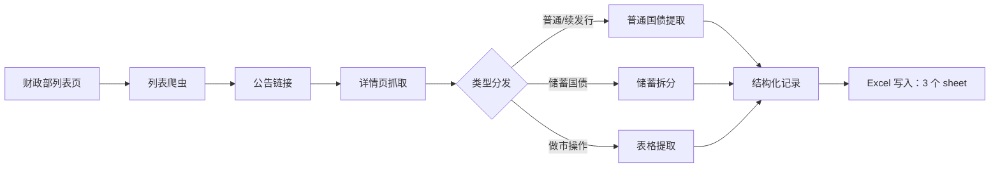

# 国债业务公告数据抓取工具

一个 Python 爬虫，自动从中华人民共和国财政部官网抓取所有国债业务公告，并整理成结构化的 Excel 表格。

## 功能特性

- **自动遍历列表页**：无需手动翻页，连续两页无数据即停止。
- **多类型覆盖**：附息国债、贴现国债、特别国债、储蓄国债，以及国债做市支持操作公告。
- **智能期限推断**：续发行公告通过偿还本金日期推算期限。
- **储蓄国债拆分**：将多期合并公告拆分为独立数据行。
- **做市操作表格提取**：支持合并单元格的表格解析。
- **格式化 Excel 输出**：表头样式、冻结首行、自适应列宽，共三个 sheet。
- **礼貌爬取**：每次请求间隔 0.3–0.5 秒随机延迟。

## 架构



## 快速开始

```bash
pip install requests beautifulsoup4 openpyxl
python3 crawl_treasury_bonds.py
```

脚本会在当前目录生成 `国债业务公告数据.xlsx`，包含三个 sheet：

| Sheet | 内容 | 数据量 |
|-------|------|--------|
| 国债发行数据 | 普通发行 + 续发行公告 | ~130 条 |
| 储蓄国债数据 | 储蓄国债多期拆分 | ~4 条 |
| 做市操作数据 | 做市支持操作公告 | ~16 条 |

*样本区间：2025/01/08 – 2026/06/24。*

### 可选配置

复制 `.env.example` 为 `.env` 可覆盖默认参数：

```bash
cp .env.example .env
```

| 变量 | 默认值 | 说明 |
|------|--------|------|
| `CGB_BASE_URL` | `https://zwgls.mof.gov.cn/ywgg/` | 列表页根地址 |
| `CGB_USER_AGENT` | 浏览器 UA | 自定义请求头 |
| `CGB_DELAY_MIN` / `CGB_DELAY_MAX` | `0.3` / `0.5` | 随机延迟区间（秒） |
| `CGB_OUTPUT_FILE` | `国债业务公告数据.xlsx` | 输出文件路径 |

## 数据来源

财政部官网 - 国债业务公告：https://zwgls.mof.gov.cn/ywgg/

## 注意事项

- 仅供研究参考，不构成投资建议。
- 请遵守网站爬取规则，不要请求过于频繁。
- 重要数据请以财政部官网原文为准。

## 许可证

MIT — 见 [LICENSE](./LICENSE)。
